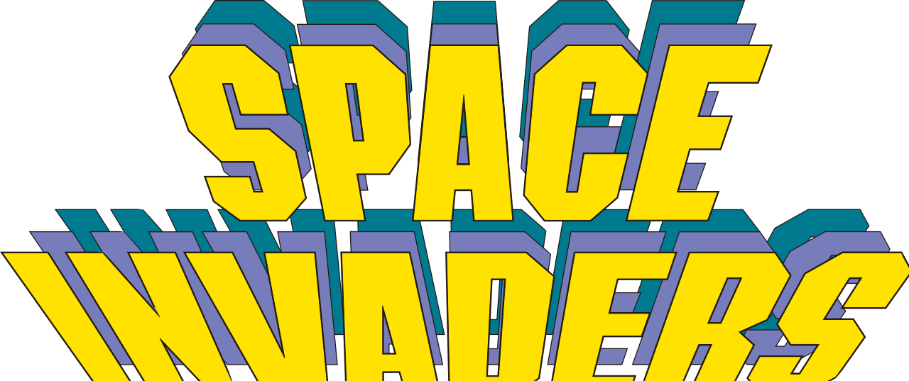

[![Contributors][contributors-shield]][contributors-url]
[![Forks][forks-shield]][forks-url]
[![Stargazers][stars-shield]][stars-url]
[![Issues][issues-shield]][issues-url]
[![MIT License][license-shield]][license-url]

<!-- PROJECT LOGO -->
 

  

  <h3 align="center">Space Invaders</h3>

  

    Retro game made it with custom game engine
     
     
    <a href="https://github.com/pomaretta/space-invaders/issues">Report Bug</a>
    ·
    <a href="https://github.com/pomaretta/space-invaders/issues">Request Feature</a>
     
     
  

<!-- TABLE OF CONTENTS -->

  
Table of Contents

  <ol>
    <li>
      <a href="#about-the-project">About The Project</a>
      <ul>
        <li><a href="#built-with">Built With</a></li>
      </ul>
    </li>
    <li><a href="#prerequisites">Prerequisites</a></li>
    <li><a href="#roadmap">Roadmap</a></li>
    <li><a href="#contributing">Contributing</a></li>
    <li><a href="#license">License</a></li>
    <li><a href="#contact">Contact</a></li>
  </ol>

<!-- ABOUT THE PROJECT -->
## About The Project

[![Product Name Screen Shot][product-screenshot]](https://carlospomares.es)

This projects is for an example of usage of the engine and see how to build a game with it, also for aid practice. I wanted to make a game with my own engine, to in the future make an online game like MMORPG genre and get some practice to make other games with other engine and get it easier to built up with it. 

### Built With

It built with Java language, with my own engine made with JavaFX, based on the GraphicsContext principle.

* [Java](https://openjdk.java.net)
* [JavaFX v11](https://openjfx.io)
* [Custom Engine](https://github.com/pomaretta/project-engine)

### Prerequisites

For making work this game, you need to have installed the Engine as a library for the project. [Download](https://github.com/pomaretta/project-engine)

<!-- ROADMAP -->
## Roadmap

See the [open issues](https://github.com/pomaretta/space-invaders/issues) for a list of proposed features (and known issues).

<!-- CONTRIBUTING -->
## Contributing

Contributions are what make the open source community such an amazing place to be learn, inspire, and create. Any contributions you make are **greatly appreciated**.

1. Fork the Project
2. Create your Feature Branch (`git checkout -b feature/AmazingFeature`)
3. Commit your Changes (`git commit -m 'Add some AmazingFeature'`)
4. Push to the Branch (`git push origin feature/AmazingFeature`)
5. Open a Pull Request

<!-- LICENSE -->
## License

Distributed under the MIT License. See `LICENSE` for more information.

<!-- CONTACT -->
## Contact

Carlos Pomares - [@pomaretta](https://twitter.com/pomaretta)

Project Link: [https://github.com/pomaretta/space-invaders](https://github.com/pomaretta/space-invaders)

<!-- MARKDOWN LINKS & IMAGES -->
<!-- https://www.markdownguide.org/basic-syntax/#reference-style-links -->
[contributors-shield]: https://img.shields.io/github/contributors/pomaretta/space-invaders.svg?style=for-the-badge
[contributors-url]: https://github.com/pomaretta/space-invaders/graphs/contributors
[forks-shield]: https://img.shields.io/github/forks/pomaretta/space-invaders.svg?style=for-the-badge
[forks-url]: https://github.com/pomaretta/space-invaders/network/members
[stars-shield]: https://img.shields.io/github/stars/pomaretta/space-invaders.svg?style=for-the-badge
[stars-url]: https://github.com/pomaretta/space-invaders/stargazers
[issues-shield]: https://img.shields.io/github/issues/pomaretta/space-invaders.svg?style=for-the-badge
[issues-url]: https://github.com/pomaretta/space-invaders/issues
[license-shield]: https://img.shields.io/github/license/pomaretta/space-invaders.svg?style=for-the-badge
[license-url]: https://github.com/pomaretta/space-invaders/blob/master/LICENSE.txt
[product-screenshot]: images/game.jpg